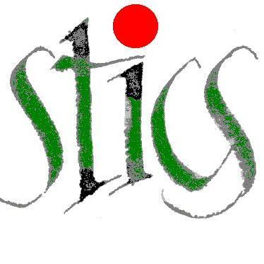

---
output:
  github_document:
   html_preview: false
---

  <!-- README.md is generated from README.Rmd. Please edit that file -->

```{r setup, echo = FALSE}
knitr::opts_chunk$set(
  collapse = TRUE,
  comment = "#>",
  fig.path = "man/figures/README-"
)
options(tibble.print_min = 5, tibble.print_max = 5)
```
  

# sticRs: the [STICS](https://www6.paca.inra.fr/stics_eng/) model R package 
<!--  -->
<!-- [](https://travis-ci.org/VEZY/DynACof)   -->
[](http://www.repostatus.org/#wip)
[](https://travis-ci.com/VEZY/sticRs)
[](https://ci.appveyor.com/project/VEZY/sticRs)
[](https://www.gnu.org/licenses/gpl-3.0)

## Overview

This package allows the user to programmatically set one or more simulations (USM), to call STICS to run them in sequence or in separate folders (if input has to be saved), to import the results for analyses and to generate automatic reports.

## Installation

The development version from [GitHub](https://github.com/) can be installed with:

``` r
devtools::install_github("VEZY/sticRs")
```
Or using the lightweight [remotes](https://github.com/r-lib/remotes#readme) package: 

``` r
# install.packages("remotes")
remotes::install_github("VEZY/sticRs")
```
For the moment, there is no [CRAN](https://CRAN.R-project.org) release of sticRs, but we work on that.
You will soon be able to run this command to install the package:

``` r
install.packages("sticRs")
```

## Example

This is a basic example using the default dummy simulation (parameters and meteorology) for a mixed crop of wheat-wheat (not a real mixed crop, for testing the model behavior) :

```{r example1, eval=FALSE}
library("sticRs")
set_usm(plant= c("wheat","wheat"))
# Reading the interrang parameter:
read_param(param='interrang')
# Setting the interrang parameter to 0.01 meter:
set_param(param= "interrang", value= 0.01)
```

To use your own data, simply use the folder of your simulation as the reference path; like you would do with javaSTICS.

Enjoy !!

## Acknowledgments

The STICS (Simulateur mulTIdisciplinaire pour les Cultures Standard, or multidisciplinary simulator for standard crops) model is a dynamic, generic and robust model aiming to simulate the soil-crop-atmosphere system. It was first developed in 1996 by INRA -the French National Institute for Agricultural research-  by Nadine Brisson and Dominique Ripoche. An overview of the model is available [here](https://www6.paca.inra.fr/stics_eng/About-us/Stics-model-overview).

The sticRs package was developed thanks to the European H2020 funded [ReMIX project](https://www.remix-intercrops.eu/).


---
